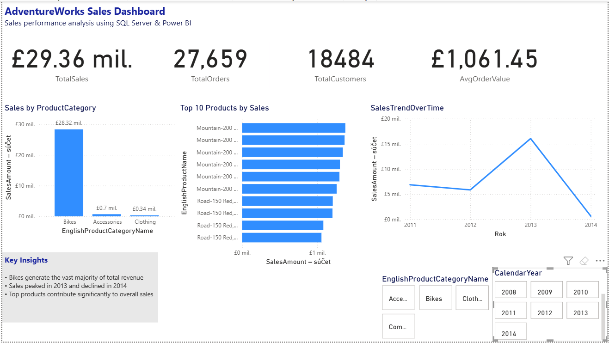

# AdventureWorks Sales Analysis

## Project Overview

This project is a data analysis portfolio project based on the AdventureWorks Data Warehouse dataset.

The goal of this project is to analyse sales performance, customer behaviour, and product performance using SQL.

The project demonstrates practical data analyst skills including data querying, data transformation, data aggregation, and business-oriented analysis.

## Power BI Dashboard Preview

## Tools & Technologies

- SQL Server
- SQL
- AdventureWorks Data Warehouse
- GitHub
- Power BI
- DAX (basic measures)
- GitHub

## Business Questions

This analysis focuses on questions such as:

- What are the total sales and number of orders?
- How many customers have made purchases?
- What is the average order value?
- Which product categories generate the highest revenue?
- Which products perform best?
- Who are the top customers by sales?

## SQL Analysis

The project includes the following SQL analyses:

01 - Sales Overview
Basic sales performance analysis:
- Total sales
- Number of orders
- Number of customers
- Average order value (AOV)

02 - Product Analysis
Product performance analysis:
- Sales by product category
- Units sold
- Top products by revenue
- Identification of top-performing products

03 - Customer Analysis
Customer behaviour analysis:
- Number of orders per customer
- Total customer revenue
- Top customers by sales
- Customer purchasing activity

04 - Customer Segmentation
Customer segmentation based on purchasing behaviour:

- Customer grouping by revenue
- Identification of high-value customers
- Analysis of customer contribution to overall sales

05 - Sales Trends Analysis
Time-based sales analysis:

- Sales performance over time
- Monthly and yearly sales trends
- Identification of changes in sales performance

06 - Top Products Ranking
Analysis of best-performing products:

- Ranking products by revenue
- Identifying highest-selling products
- Comparing product performance

07 - Returning Customers Analysis
Customer retention analysis:

- Identification of repeat customers
- Number of returning customers
- Analysis of customer loyalty behaviour

08 - Sales By Country Analysis
Geographic sales analysis:

- Sales distribution by country
- Identification of high-performing markets
- Comparison of regional sales performance

## Power BI Dashboard

An interactive Power BI dashboard was created to visualize sales performance and support business decision-making.

The dashboard includes:

  KPI overview:
  - Total Sales
  - Total Orders
  - Total Customers
  - Average Order Value

  Sales analysis:
  - Sales by product category
  - Sales trends over time
  - Top 10 products by revenue

  Interactive filters:
  - Year
  - Product category

  Business insights based on sales performance trends.

## Dataset

Dataset:
AdventureWorks Data Warehouse

Source:
Microsoft sample database

## Project Structure

AdventureWorks-Portfolio
│
├── README.md
│
├── SQL
│   ├── 01_Sales_Overview.sql
│   ├── 02_Product_Analysis.sql
│   ├── 03_Customer_Analysis.sql
│   ├── 04_Customer_Segmentation.sql
│   ├── 05_Sales_Trends.sql
│   ├── 06_Top_Products.sql
│   ├── 07_Returning_Customers.sql
│   └── 08_Sales_By_Country.sql
│
└── Power BI
    └── AdventureWorks_Sales_Dashboard.pbix

## Project Status

✅ SQL analysis completed
✅ Power BI dashboard completed

Implemented analyses:

  Sales overview and KPI calculation
  Product performance analysis
  Customer analysis
  Customer segmentation
  Sales trends analysis
  Top product ranking
  Returning customer analysis
  Geographic sales analysis

